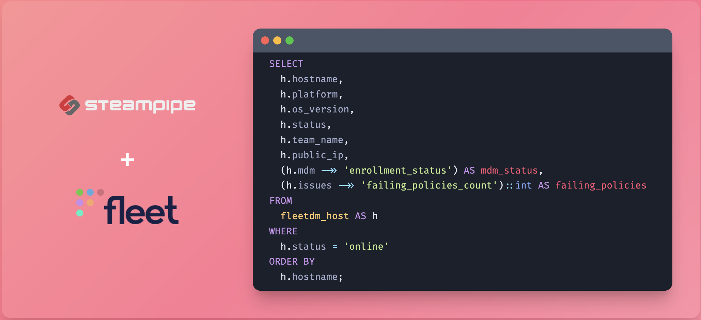

# Steampipe Plugin for FleetDM

Use SQL to access FleetDM and analyze your device data, including hosts, software, users, teams, policies, queries, packs, labels, and activities.

- **[Get started →](https://hub.steampipe.io/plugins/l-teles/fleetdm)**
- Documentation: [Table definitions & examples](https://hub.steampipe.io/plugins/l-teles/steampipe-plugin-fleetdm/tables)
- Community: [Join #steampipe on Slack →](https://turbot.com/community/join)
- Get involved: [Issues](https://github.com/l-teles/steampipe-plugin-fleetdm/issues)

## Quick start

Install the plugin with [Steampipe](https://steampipe.io):

```sh
steampipe plugin install l-teles/fleetdm
```

Configure the API token in `~/.steampipe/config/fleetdm.spc`:

```hcl
connection "fleetdm" {
  plugin = "l-teles/fleetdm" 

  # FleetDM server URL (e.g., "https://fleet.example.com")
  # The plugin will attempt to append /api/v1/ if it's not present.
  server_url = "https://aiworld.cloud.fleetdm.com/"

  # FleetDM API Token
  # Generate this from your FleetDM instance (User Menu -> Settings -> API Tokens)
  api_token = "ZZFN9BBL+OldDYVf+qfu7+XUPTghBzs61V1fRHg/2RkuYYq6qlLiDaRgcsZVW1WtqAawHj0qMmDCCPL1vlFdHw=="
}
```

Run a query:

```sql
SELECT
  id,
  hostname,
  display_name,
  os_version,
  platform,
  status,
  seen_time,
  team_name,
  uptime -- Uptime in nanoseconds
FROM
  fleetdm_host
WHERE
  platform = 'darwin' AND status = 'online'
ORDER BY
  id;
```

```
+-----+------------------+--------------+--------------+----------+--------+---------------------------+---------------+-----------------------+
| id  | hostname         | display_name | os_version   | platform | status | seen_time                 | team_name     | uptime                |
+-----+------------------+--------------+--------------+----------+--------+---------------------------+---------------+-----------------------+
| 11  | ZTKDTQZTT9.lan   | ZTKDTQZTT9   | macOS 16.2.0 | darwin   | online | 2025-05-07T00:09:40+01:00 | Lisbon Office | 375,531,000,000,000   |
| 30  | J344W72143       | J344W72143   | macOS 16.2.0 | darwin   | online | 2025-05-07T00:08:55+01:00 | Lisbon Office | 1,630,812,000,000,000 |
| 31  | ZK4MGDW2LP       | ZK4MGDW2LP   | macOS 16.2.0 | darwin   | online | 2025-05-07T00:09:44+01:00 | Lisbon Office | 1,320,962,000,000,000 |
| 33  | N2TW0K2K6L       | N2TW0K2K6L   | macOS 16.2.0 | darwin   | online | 2025-05-07T00:09:34+01:00 | Lisbon Office | 1,259,147,000,000,000 |
| 35  | GXG54MWCXD       | GXG54MWCXD   | macOS 16.2.0 | darwin   | online | 2025-05-07T00:09:44+01:00 | Lisbon Office | 210,057,000,000,000   |
| 38  | Z77PTJYKPJ       | Z77PTJYKPJ   | macOS 16.2.0 | darwin   | online | 2025-05-07T00:09:50+01:00 | Lisbon Office | 1,178,878,000,000,000 |
| 41  | C7JXXMPYL0       | C7JXXMPYL0   | macOS 16.2.0 | darwin   | online | 2025-05-07T00:09:50+01:00 | Lisbon Office | 1,696,776,000,000,000 |
| 43  | CCX99XC063       | CCX99XC063   | macOS 16.2.0 | darwin   | online | 2025-05-07T00:09:50+01:00 | Lisbon Office | 557,994,000,000,000   |
| 48  | ZJZ27WTNZJ       | ZJZ27WTNZJ   | macOS 16.2.0 | darwin   | online | 2025-05-07T00:09:45+01:00 | Lisbon Office | 1,128,396,000,000,000 |
| 49  | G74TCTQWT4       | G74TCTQWT4   | macOS 16.7   | darwin   | online | 2025-05-07T00:09:44+01:00 | Lisbon Office | 137,775,000,000,000   |
| 50  | LZZD2XTXQ2       | LZZD2XTXQ2   | macOS 16.2.0 | darwin   | online | 2025-05-07T00:09:45+01:00 | Lisbon Office | 1,393,388,000,000,000 |
| 54  | J7G00M0W23       | J7G00M0W23   | macOS 16.2.0 | darwin   | online | 2025-05-07T00:09:45+01:00 | Lisbon Office | 393,651,000,000,000   |
| 57  | KY35TT6D1T       | KY35TT6D1T   | macOS 16.2.0 | darwin   | online | 2025-05-07T00:09:44+01:00 | Lisbon Office | 1,246,948,000,000,000 |
| 61  | D7RXCTJD2Z       | D7RXCTJD2Z   | macOS 16.2.0 | darwin   | online | 2025-05-07T00:09:40+01:00 | Lisbon Office | 53,105,000,000,000    |
| 63  | CTWDTWXDTT       | CTWDTWXDTT   | macOS 16.2.0 | darwin   | online | 2025-05-07T00:09:45+01:00 | Lisbon Office | 376,566,000,000,000   |
| 64  | P4999T5KTL       | P4999T5KTL   | macOS 16.2.0 | darwin   | online | 2025-05-07T00:09:44+01:00 | Lisbon Office | 1,253,534,000,000,000 |
| 66  | L92PWYP0C7       | L92PWYP0C7   | macOS 16.2.0 | darwin   | online | 2025-05-07T00:09:35+01:00 | Lisbon Office | 1,570,853,000,000,000 |
| 69  | R293KY46T2       | R293KY46T2   | macOS 16.2.0 | darwin   | online | 2025-05-07T00:09:34+01:00 | Lisbon Office | 1,033,368,000,000,000 |
| 70  | LXGG4TYTJX.dlink | LXGG4TYTJX   | macOS 16.2.0 | darwin   | online | 2025-05-07T00:09:44+01:00 | Lisbon Office | 1,247,043,000,000,000 |
| 72  | QX912CCWQL       | QX912CCWQL   | macOS 16.7   | darwin   | online | 2025-05-07T00:09:45+01:00 | Lisbon Office | 748,816,000,000,000   |
| 77  | YR1W3RQPTT       | YR1W3RQPTT   | macOS 16.7   | darwin   | online | 2025-05-07T00:09:44+01:00 | Lisbon Office | 1,263,228,000,000,000 |
| 78  | QT4T9PTGXT       | QT4T9PTGXT   | macOS 16.2.0 | darwin   | online | 2025-05-07T00:09:34+01:00 | Lisbon Office | 1,267,734,000,000,000 |
| 84  | TQTGW3GQT05T     | TQTGW3GQT05T | macOS 16.2.0 | darwin   | online | 2025-05-07T00:09:50+01:00 | Lisbon Office | 140,851,000,000,000   |
| 91  | N2TMW4C2Y9       | N2TMW4C2Y9   | macOS 16.2.0 | darwin   | online | 2025-05-07T00:09:44+01:00 | Lisbon Office | 1,593,971,000,000,000 |
| 93  | C0959WL7N3       | C0959WL7N3   | macOS 16.7   | darwin   | online | 2025-05-07T00:09:45+01:00 | Lisbon Office | 1,266,167,000,000,000 |
| 94  | KPQGTZX26T       | KPQGTZX26T   | macOS 16.2.0 | darwin   | online | 2025-05-07T00:09:24+01:00 | Lisbon Office | 1,592,664,000,000,000 |
| 96  | N40NJ0K6XY       | N40NJ0K6XY   | macOS 16.2.0 | darwin   | online | 2025-05-07T00:09:50+01:00 | Lisbon Office | 1,249,775,000,000,000 |
| 99  | DWMZ39962N       | DWMZ39962N   | macOS 16.2.0 | darwin   | online | 2025-05-07T00:09:44+01:00 | Lisbon Office | 365,479,000,000,000   |
| 100 | KTCX6M0XTX       | KTCX6M0XTX   | macOS 16.2.0 | darwin   | online | 2025-05-07T00:09:24+01:00 | Lisbon Office | 572,287,000,000,000   |
| 101 | XP919MWJ2N       | XP919MWJ2N   | macOS 16.2.0 | darwin   | online | 2025-05-07T00:09:40+01:00 | Lisbon Office | 431,944,000,000,000   |
| 184 | GN42CZTYYX       | GN42CZTYYX   | macOS 16.7   | darwin   | online | 2025-05-07T00:09:44+01:00 | Lisbon Office | 7,797,000,000,000     |
| 189 | LQX7D0WX6Y       | LQX7D0WX6Y   | macOS 16.2.0 | darwin   | online | 2025-05-07T00:09:10+01:00 | Lisbon Office | 1,675,872,000,000,000 |
+-----+------------------+--------------+--------------+----------+--------+---------------------------+---------------+-----------------------+
```

## Development

Prerequisites:

- [Steampipe](https://steampipe.io/downloads)
- [Golang](https://golang.org/doc/install)

Clone:

```sh
git clone https://github.com/l-teles/steampipe-plugin-fleetdm.git
cd steampipe-plugin-fleetdm
```

Build, which automatically installs the new version to your `~/.steampipe/plugins` directory:

```
make
```

Configure the plugin:

```
cp config/* ~/.steampipe/config
vi ~/.steampipe/config/fleetdm.spc
```

Try it!

```
steampipe query
> .inspect fleetdm
```

Further reading:

- [Writing plugins](https://steampipe.io/docs/develop/writing-plugins)
- [Writing your first table](https://steampipe.io/docs/develop/writing-your-first-table)

## Contributing

Please see the [contribution guidelines](https://github.com/turbot/steampipe/blob/main/CONTRIBUTING.md) and our [code of conduct](https://github.com/turbot/steampipe/blob/main/CODE_OF_CONDUCT.md). All contributions are subject to the [Apache 2.0 open source license](https://github.com/l-teles/steampipe-plugin-fleetdm/blob/main/LICENSE).

`help wanted` issues:

- [Steampipe](https://github.com/turbot/steampipe/labels/help%20wanted)
- [FleetDM Plugin](https://github.com/l-teles/steampipe-plugin-fleetdm/labels/help%20wanted)


<!-- ## Prerequisites

* [Steampipe](https://steampipe.io/downloads) installed.
* [Go](https://golang.org/dl/) >= 1.21 (or your current Go version) installed (required for plugin development or building from source).
* A FleetDM instance and an API token with appropriate permissions. You can generate an API token from your FleetDM instance (User Menu -> Settings -> API Tokens).

## Installation

1.  **Clone the repository (if building from source):**
    If you are contributing or building the plugin manually:
    ```bash
    # Replace with your actual repository path
    git clone [https://github.com/your-username/steampipe-plugin-fleetdm.git](https://github.com/your-username/steampipe-plugin-fleetdm.git)
    cd steampipe-plugin-fleetdm
    ```

2.  **Build the plugin:**
    ```bash
    go mod tidy
    go build
    ```
    This command compiles the plugin and creates an executable file named `steampipe-plugin-fleetdm` (or `steampipe-plugin-fleetdm.exe` on Windows) in the project's root directory.

3.  **Link the plugin to Steampipe:**
    Steampipe loads plugins from specific directories. For local development, the recommended method is to link your compiled plugin.

    * Create the plugin directory (if it doesn't already exist). The directory name `fleetdm` **must** match the `plugin` attribute in your connection configuration (`.spc` file).
        ```bash
        mkdir -p ~/.steampipe/plugins/local/fleetdm
        ```
    * Create a symbolic link from your compiled plugin executable to this directory. The plugin binary within this directory **must** be named `fleetdm.plugin`.

        On Linux/macOS:
        ```bash
        # Ensure you are in the root directory of your steampipe-plugin-fleetdm project
        ln -s "$(pwd)/steampipe-plugin-fleetdm" ~/.steampipe/plugins/local/fleetdm/fleetdm.plugin
        ```

        On Windows (using PowerShell as Administrator):
        ```powershell
        # Ensure you are in the root directory of your steampipe-plugin-fleetdm project
        New-Item -ItemType SymbolicLink -Path "$env:USERPROFILE\.steampipe\plugins\local\fleetdm\fleetdm.plugin" -Target "$(Get-Location)\steampipe-plugin-fleetdm.exe"
        ```

    For more detailed instructions, refer to the Steampipe documentation on [Plugin Development - Build & Install](https://steampipe.io/docs/develop/writing-plugins#build-the-plugin).

## Configuration

Create a connection configuration file for your FleetDM plugin. Steampipe typically looks for `.spc` files in the `~/.steampipe/config/` directory.

Create a file named `fleetdm.spc` (e.g., `~/.steampipe/config/fleetdm.spc`) with the following content:

```hcl
connection "fleetdm" {
  plugin = "l-teles/fleetdm" 

  # FleetDM server URL (e.g., "https://fleet.example.com")
  # The plugin will attempt to append /api/v1/ if it's not present.
  server_url = "https://aiworld.cloud.fleetdm.com/"

  # FleetDM API Token
  # Generate this from your FleetDM instance (User Menu -> Settings -> API Tokens)
  api_token = "ZZFN9BBL+OldDYVf+qfu7+XUPTghBzs61V1fRHg/2RkuYYq6qlLiDaRgcsZVW1WtqAawHj0qMmDCCPL1vlFdHw=="
}
```

Replace `YOUR_FLEETDM_SERVER_URL` and `YOUR_FLEETDM_API_TOKEN` with your actual FleetDM server URL and API token.

## Usage

Once the plugin is installed and configured, you can query your FleetDM instance using SQL.

Open the Steampipe query console:
```bash
steampipe query
```

Then, run queries against the available tables.

**Available Tables:**

* `fleetdm_activity`
* `fleetdm_host`
* `fleetdm_label`
* `fleetdm_pack`
* `fleetdm_policy`
* `fleetdm_query`
* `fleetdm_software`
* `fleetdm_team`
* `fleetdm_user`

**Example Queries:**

### `fleetdm_host`

List all online macOS hosts and their OS versions:
```sql
SELECT
  id,
  hostname,
  display_name,
  os_version,
  platform,
  status,
  seen_time,
  team_name,
  uptime -- Uptime in nanoseconds
FROM
  fleetdm_host
WHERE
  platform = 'darwin' AND status = 'online'
ORDER BY
  hostname;
```

Get detailed MDM information for a specific host:
```sql
SELECT
  id,
  hostname,
  mdm ->> 'enrollment_status' AS mdm_enrollment_status,
  mdm ->> 'server_url' AS mdm_server_url,
  mdm ->> 'name' AS mdm_solution_name
FROM
  fleetdm_host
WHERE
  id = 24; -- Replace with an actual host ID
```

### `fleetdm_software`

List the top 10 most installed software:
```sql
SELECT
  name,
  version,
  source,
  host_count
FROM
  fleetdm_software
ORDER BY
  host_count DESC
LIMIT 10;
```

Find software with known vulnerabilities (if vulnerability processing is enabled in FleetDM):
```sql
SELECT
  name,
  version,
  host_count,
  vulnerabilities
FROM
  fleetdm_software
WHERE
  vulnerable_only = true; -- Uses KeyColumn for API filtering
```

### `fleetdm_user`

List all users and their global roles:
```sql
SELECT
  id,
  name,
  email,
  global_role,
  api_only
FROM
  fleetdm_user
ORDER BY
  name;
```

### `fleetdm_team`

List all teams and their member/host counts:
```sql
SELECT
  id,
  name,
  description,
  user_count,
  host_count
FROM
  fleetdm_team
ORDER BY
  name;
```

### `fleetdm_policy`

List all global policies and their pass/fail counts:
```sql
SELECT
  id,
  name,
  platform,
  passing_host_count,
  failing_host_count,
  team_id -- Will be null for global policies
FROM
  fleetdm_policy -- This table queries /global/policies
ORDER BY
  name;
```

Search for policies by keyword (searches name and query text):
```sql
SELECT
  id,
  name,
  query_text -- Column name for the policy's SQL
FROM
  fleetdm_policy
WHERE
  filter_search_query = 'firewall'; -- KeyColumn for API search parameter
```

### `fleetdm_query`

List all saved queries:
```sql
SELECT
  id,
  name,
  query_sql,
  author_name,
  team_id
FROM
  fleetdm_query
ORDER BY
  name;
```

### `fleetdm_pack`

List all query packs:
```sql
SELECT
  id,
  name,
  type,
  platform,
  disabled,
  target_count
FROM
  fleetdm_pack
ORDER BY
  name;
```

### `fleetdm_label`

List all labels and their associated host counts:
```sql
SELECT
  id,
  name,
  label_type,
  label_membership_type,
  host_count,
  query_sql
FROM
  fleetdm_label
ORDER BY
  name;
```

### `fleetdm_activity`

List the 50 most recent activities:
```sql
SELECT
  id,
  created_at,
  actor_full_name,
  type,
  details ->> 'description' AS activity_description -- Example: extract a field from details JSON
FROM
  fleetdm_activity
ORDER BY
  id DESC -- Default ordering by API is also ID descending
LIMIT 50;
```

## Developing Further

This plugin provides a solid foundation for interacting with your FleetDM data. You can extend its capabilities by:

* **Adding More Tables:** Identify other FleetDM API endpoints that provide useful data (e.g., specific MDM solution details, host vulnerability lists if not covered by software, etc.) and create new tables.
* **Expanding Columns:** If the FleetDM API adds new fields to existing objects, update the corresponding Go structs and table column definitions.
* **Implementing More KeyColumns:** For API list endpoints that support additional filtering parameters (e.g., filtering hosts by `os_version`), add corresponding `KeyColumn` definitions to the table's `ListConfig` to enable more efficient server-side filtering.
* **Hydration for Related Data:** For complex relationships not directly provided by an endpoint (e.g., fetching full details of hosts belonging to a label if the label endpoint only returns host IDs), implement custom Steampipe hydrate functions.
* **Improving Error Handling:** Enhance error handling within the API client and table functions for more specific and user-friendly error messages.
* **Writing Tests:** Add Go tests for your plugin's functions and table definitions to ensure reliability and catch regressions.

## Contributing

Contributions are highly welcome! If you'd like to contribute:
1.  Fork the repository.
2.  Create a new branch for your feature or bug fix.
3.  Make your changes, ensuring code is well-commented and follows Go best practices.
4.  Add tests for your changes.
5.  Commit your changes and push to your fork.
6.  Submit a pull request to the main repository.

Please ensure your pull request describes the changes clearly. -->
